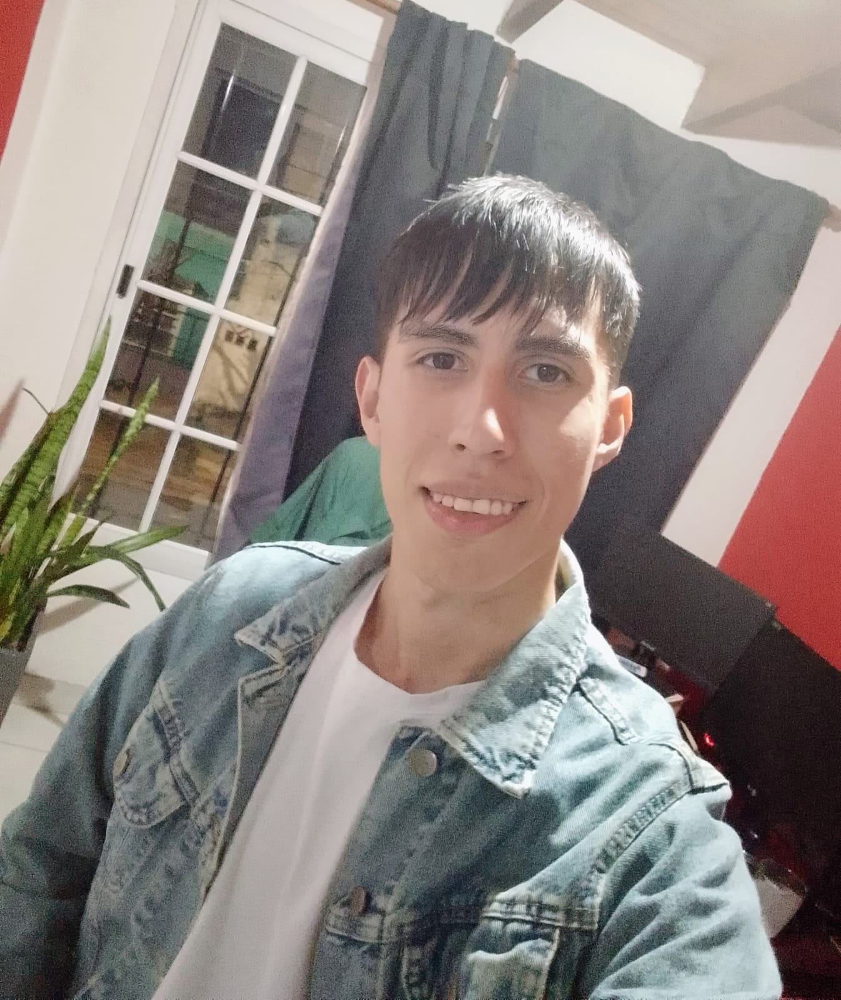

# Racedo Kevin
## Presentación personal
Mi nombre es Racedo Kevin, vivo en Morón y aparte de estudiar programación soy Profesor de Matemática desde el 2023.
Puntualmente este sería mi tercer cuatrimestre de la carrera de Tecnicatura Universitaria en programación, especialmente mi 2do año en la universidad.

### ¿Por qué esta carrera y no otra?
Desde siempre la informatica y la programación puntualmente fue algo que me llamaba muchísimo la atención, pero por razones de la vida termine estudiando para ser profesor de matemática y postergando para más adelante esta carrera.
Luego de 2 años, y con mucha incertidumbre al respecto, me termine anotando para arrancar la tan ansiada carrera desde siempre. La cuestión es ¿por qué la elegí?, principalmente se debe a mis ansias de programas informáticos que tengan una utilidad para las personas, y que no solo se quede en conocimiento vago que no tiene un fin alguno.

### Mis gustos
- En mis tiempos libres me gusta jugar videojuegos, especialmente aquellos del género shooter, y ver animé
- Tengo mucha curiosidad e interes acerca de aprender cosas que tengan una utilidad en la vida contidiana, y/o me ayuden a comprender como funcionan las cosa del mismo universo.
- Me gusta hacer viajes en moto. Por el momento no son viajes tan largos, pero más adelante me gustaría hacerlos.